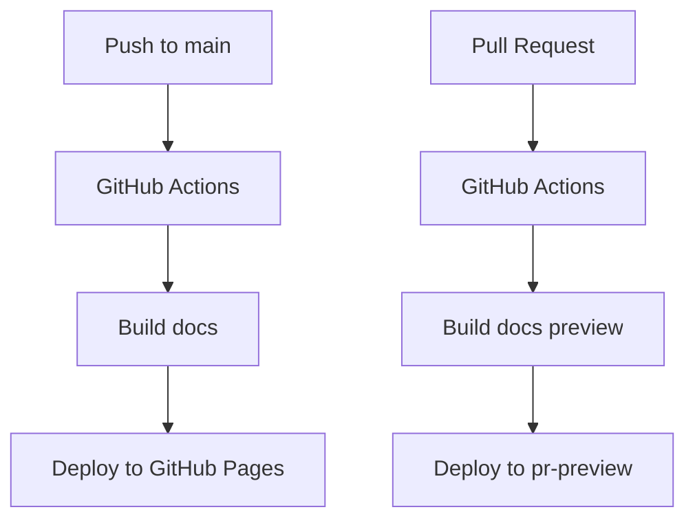

# Documentation Guide

This guide covers everything you need to know about writing, maintaining, and deploying documentation for dagster-ray.

## Overview

The dagster-ray documentation is built with [MkDocs](https://www.mkdocs.org/) and [Material for MkDocs](https://squidfunk.github.io/mkdocs-material/), with automatic API reference generation using [mkdocstrings](https://mkdocstrings.github.io/).

### Documentation Structure

```
docs/
├── api/                    # API reference documentation
│   ├── core.md            # Core components
│   └── kuberay.md         # KubeRay integration
├── assets/                # Static assets (images, stylesheets)
├── contributing/          # Contributor guides
├── includes/              # Reusable content snippets
├── tutorial/              # User tutorials
├── api.md                 # API overview
└── index.md               # Home page
```

## Local Development Setup

### Prerequisites

1. **Python Environment**: Ensure you have Python 3.9+ installed
2. **UV Package Manager**: The project uses `uv` for dependency management

### Setup Steps

1. **Clone and Setup Environment**:
   ```bash
   git clone https://github.com/danielgafni/dagster-ray.git
   cd dagster-ray
   uv sync --all-extras
   ```

2. **Serve Documentation Locally**:
   ```bash
   uv run mkdocs serve
   ```

   This starts a development server at `http://localhost:8000` with live-reload.

3. **Build Documentation**:
   ```bash
   uv run mkdocs build --clean
   ```

### Development Workflow

1. **Make Changes**: Edit markdown files in the `docs/` directory
2. **Preview**: Use `mkdocs serve` to preview changes locally
3. **Validate**: Run documentation validation (see below)
4. **Test Build**: Ensure `mkdocs build --strict` passes
5. **Commit and Push**: Create a pull request

## Writing Documentation

### Markdown Guidelines

- **Use consistent heading hierarchy**: Start with `#` for page titles, `##` for main sections
- **Add proper spacing**: Leave blank lines around headings and code blocks
- **Use descriptive link text**: Avoid "click here" or bare URLs
- **Include code examples**: Show practical usage where appropriate

### Code Examples

Always test code examples before including them:

```python
from dagster import asset, job
from dagster_ray import ray_resource


@asset(resource_defs={"ray": ray_resource})
def my_asset(context):
    ray = context.resources.ray
    # Your code here
    return result
```

### Cross-References

Use mkdocstrings' cross-reference syntax for linking to API elements:

- `[RayResource][dagster_ray.resources.RayResource]`
- `[ray_resource][dagster_ray.resources.ray_resource]`

### API Documentation

API documentation is automatically generated from docstrings. Follow these guidelines:

#### Docstring Format

Use Google-style docstrings:

```python
def my_function(param1: str, param2: int = 0) -> bool:
    """Brief description of the function.

    Longer description with more details about what the function does,
    how it works, and any important considerations.

    Args:
        param1: Description of the first parameter.
        param2: Description of the second parameter. Defaults to 0.

    Returns:
        Description of the return value.

    Raises:
        ValueError: When param1 is empty.

    Examples:
        Basic usage:

        ```python
        result = my_function("hello", 42)
        ```
    """
    # Implementation here
```

#### What to Document

- **All public classes and functions**
- **Parameters and return values**
- **Exceptions that can be raised**
- **Usage examples**
- **Important notes or warnings**

## Testing Documentation

### Automated Validation

Run the documentation validation script:

```bash
uv run python scripts/validate_docs.py
```

This checks for:
- Markdown syntax issues
- Broken internal links
- Missing API references
- Python syntax errors in code examples

### Manual Testing

1. **Build with strict mode**:
   ```bash
   uv run mkdocs build --strict
   ```
   This fails on any warnings or errors.

2. **Check specific pages**:
   ```bash
   uv run mkdocs serve
   # Navigate to your changed pages
   ```

3. **Test all internal links**: Browse through the documentation and click internal links.

### CI/CD Testing

Every pull request automatically:
- Builds documentation with strict mode
- Validates configuration
- Checks for broken links
- Deploys a preview at `https://danielgafni.github.io/dagster-ray/pr-preview/pr-<number>/`

## Deployment Process

### Automatic Deployment

Documentation is automatically deployed when:

1. **Pull Request**: Preview deployment to `/pr-preview/pr-<number>/`
2. **Main Branch**: Production deployment to `https://danielgafni.github.io/dagster-ray/`
3. **Releases**: Updated documentation with release-specific content

### Manual Deployment

If needed, you can manually trigger deployment:

```bash
# Via GitHub CLI
gh workflow run docs.yml

# Or through GitHub web interface
# Go to Actions > Documentation > Run workflow
```

### Deployment Architecture



## Configuration

### MkDocs Configuration

Key configuration in `mkdocs.yml`:

- **Theme**: Material theme with custom colors
- **Plugins**: Search, git info, mkdocstrings, minification
- **Navigation**: Organized by user journey
- **Extensions**: Enhanced markdown features

### GitHub Actions

Three main workflows:

1. **CI.yml**: Runs tests and deploys PR previews
2. **docs.yml**: Deploys production documentation
3. **release.yml**: Handles package releases

## Troubleshooting

### Common Issues

#### Build Failures

**Error**: `ModuleNotFoundError` during mkdocstrings processing
```
Solution: Ensure all dependencies are installed:
uv sync --all-extras
```

**Error**: `Configuration error` in mkdocs
```
Solution: Validate configuration:
uv run mkdocs config
```

**Error**: Broken cross-references
```
Solution: Check module paths and ensure they're importable:
python -c "import dagster_ray.resources"
```

#### Preview Deployment Issues

**Issue**: PR preview not updating
```
Solution: Check GitHub Actions logs and ensure permissions are set correctly
```

**Issue**: Preview shows 404 errors
```
Solution: Check that base_url is configured correctly for preview deployment
```

### Getting Help

1. **Check GitHub Actions logs** for detailed error messages
2. **Run validation script** locally to catch issues early
3. **Test build locally** with `mkdocs build --strict`
4. **Ask in issues** if you encounter persistent problems

## Maintenance Tasks

### Regular Maintenance

- **Monthly**: Review and update outdated examples
- **Per Release**: Update version-specific documentation
- **Quarterly**: Audit internal links and fix broken ones
- **As
